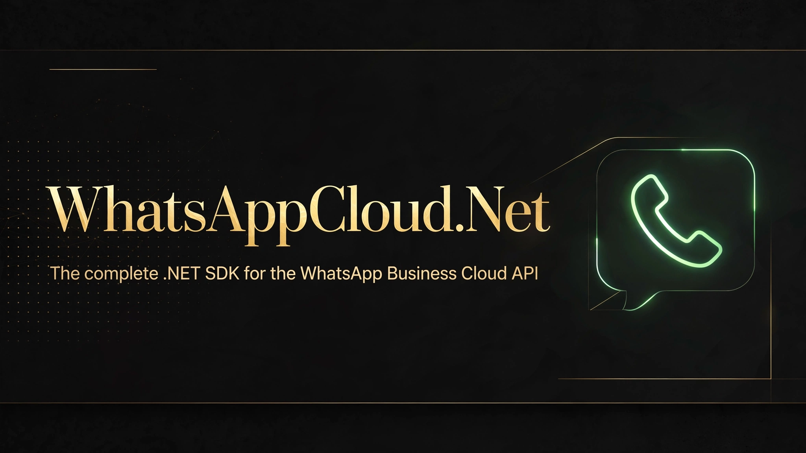

[](LICENSE)
[](https://dotnet.microsoft.com/)
[](https://github.com/SENESO/WhatsAppCloud.Net/stargazers)

# WhatsAppCloud.Net

The missing .NET SDK for Meta's **WhatsApp Business Cloud API** — more complete
than Meta's own Node.js SDK: every message type, read receipts, replies,
webhook security, and typed parsing.

Send text, template, image, video, audio, document, sticker, location,
contacts, and interactive buttons/lists. Verify webhooks, parse inbound
messages. No dependencies beyond `System.Text.Json`. Targets `netstandard2.0`
and `net8.0`.

## Install

```bash
dotnet add package WhatsAppCloud.Net
```
_(package publishing coming with v1.0.0 — for now reference the project)_

## Quick start

```csharp
using WhatsAppCloud;

var client = new WhatsAppClient(new WhatsAppClientOptions
{
    PhoneNumberId = "<phone-number-id>",   // from the Meta developer console
    AccessToken = "<access-token>"         // system user token
});

// Free-form text (needs an open 24h customer service window)
await client.SendTextAsync("201012345678", "Hello from .NET!");

// Approved template with {{1}}, {{2}} parameters
await client.SendTemplateAsync("201012345678", "order_update", "en_US",
    new[] { "Eslam", "12345" });

// Image by URL
await client.SendImageAsync("201012345678",
    "https://example.com/order.jpg", caption: "Your order shipped!");

// Video, audio, document, sticker
await client.SendVideoAsync("201012345678", "https://example.com/demo.mp4");
await client.SendDocumentAsync("201012345678", "https://example.com/invoice.pdf", filename: "invoice.pdf");

// Location & contacts
await client.SendLocationAsync("201012345678", 30.0444, 31.2357, "Cairo", "Egypt");
await client.SendContactsAsync("201012345678", new[]
{
    new WhatsAppContact { FormattedName = "Ahmed Hassan", FirstName = "Ahmed",
        Phones = new List<ContactPhone> { new ContactPhone { Phone = "+201012345678" } } }
});

// Interactive reply buttons (up to 3)
await client.SendButtonsAsync("201012345678", "Confirm your order?",
    new[]
    {
        new ReplyButton { Id = "confirm", Title = "Confirm" },
        new ReplyButton { Id = "cancel", Title = "Cancel" }
    });

// Interactive list
await client.SendListAsync("201012345678", "Pick a drink", "Open menu",
    new[]
    {
        new ListSection
        {
            Title = "Drinks",
            Rows = new List<ListRow>
            {
                new ListRow { Id = "tea", Title = "Tea" },
                new ListRow { Id = "coffee", Title = "Coffee", Description = "Freshly brewed" }
            }
        }
    });

// Reply to a specific message (works on every send method)
await client.SendTextAsync("201012345678", "Got it!", replyToMessageId: "wamid.xyz");

// Blue ticks — call when your webhook receives a message
await client.MarkAsReadAsync("wamid.xyz");
```

Bring your own `HttpClient` (e.g. from `IHttpClientFactory`):

```csharp
var client = new WhatsAppClient(options, httpClient);
```

## Webhooks

Verification handshake (the GET Meta sends when you save the webhook URL):

```csharp
using WhatsAppCloud.Webhooks;

var challenge = WebhookSecurity.VerifyChallenge(
    mode, verifyToken, challengeParam, expectedVerifyToken);
if (challenge != null) return Results.Text(challenge); // 200 with the challenge
```

Validate inbound POSTs — never skip this on a public URL:

```csharp
var signature = Request.Headers["X-Hub-Signature-256"];
var body = await new StreamReader(Request.Body).ReadToEndAsync();
if (!WebhookSecurity.IsValidSignature(appSecret, body, signature))
    return Results.Unauthorized();

var payload = WebhookParser.Parse(body);
foreach (var msg in WebhookParser.GetMessages(payload))
    Console.WriteLine($"{msg.From}: {msg.Text}");

foreach (var status in WebhookParser.GetStatuses(payload))
    Console.WriteLine($"{status.MessageId}: {status.Status}");
```

## API notes

- Default Graph API version is `v26.0`; override with `WhatsAppClientOptions.ApiVersion`.
- API errors throw `WhatsAppApiException` with Meta's `code` and `type`.
- `SendMessageResult.MessageId` is the `wamid.…` you can correlate with webhook statuses.

## Why not just use the REST API directly?

You can — this SDK just removes the boilerplate: correct payload shapes, template components, auth headers, error mapping, webhook signature validation (constant-time), and payload parsing. PRs welcome.

## License

MIT
